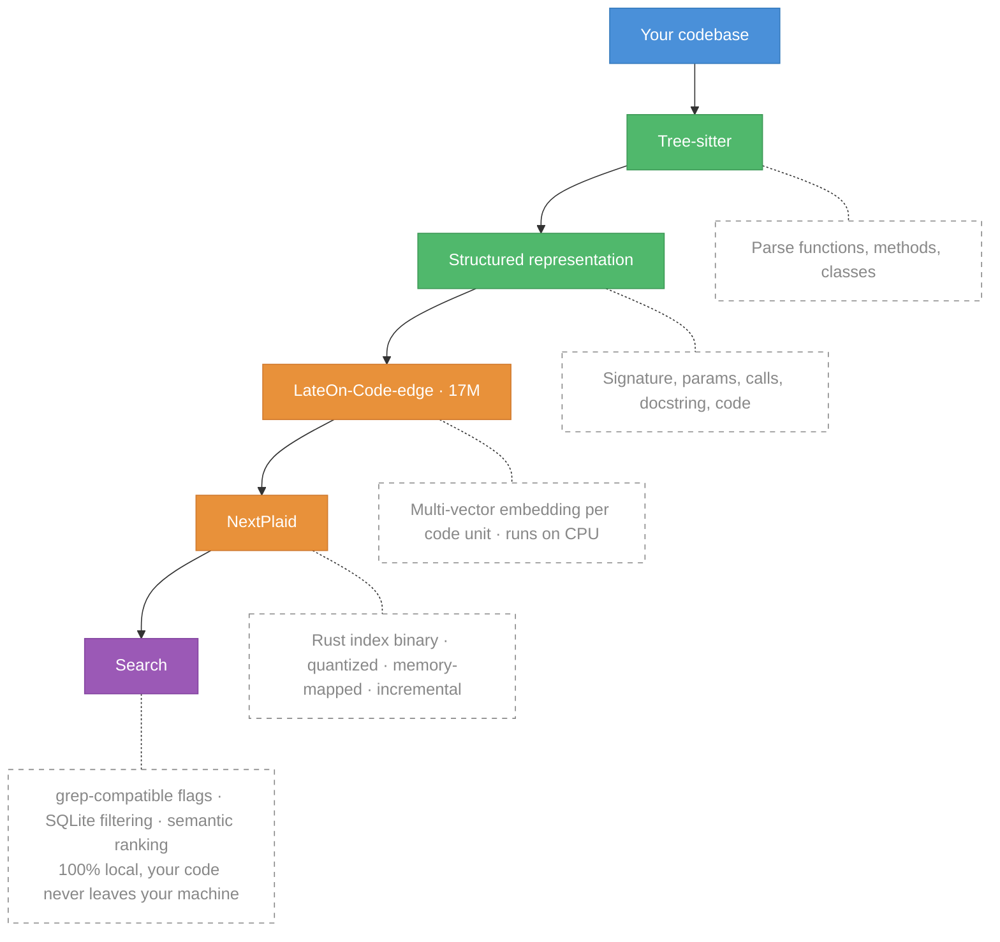

<div align="center">
  <h1>NextPlaid & ColGREP</h1>
  <p><b>NextPlaid</b> is a multi-vector search engine. <b>ColGREP</b> is semantic code search, built on it.</p>

  <p>
    <a href="#colgrep"><b>ColGREP</b></a>
    ·
    <a href="#nextplaid"><b>NextPlaid</b></a>
    ·
    <a href="#models"><b>Models</b></a>
    ·
    <a href="https://lightonai.github.io/next-plaid/"><b>Docs</b></a>
  </p>
</div>

<p align="center">
  
</p>

---

## ColGREP

Semantic code search for your terminal and your coding agents. Searches combine regex filtering with semantic ranking. All local, your code never leaves your machine.

### Quick start

Install:

```bash
curl --proto '=https' --tlsv1.2 -LsSf https://github.com/lightonai/next-plaid/releases/latest/download/colgrep-installer.sh | sh
```

Search:

```bash
colgrep "database connection pooling"
```

That's it. The first run builds the index automatically. No server, no API, no dependencies. ColGREP is a single Rust binary with everything baked in.

Regex meets semantics:

```bash
colgrep -e "async.*await" "error handling"
```

### Agent integrations

| Tool        | Install                         |
| ----------- | ------------------------------- |
| Claude Code | `colgrep --install-claude-code` |
| OpenCode    | `colgrep --install-opencode`    |
| Codex       | `colgrep --install-codex`       |

> Restart your agent after installing. Claude Code has full hooks support. OpenCode and Codex integrations are basic for now, PRs welcome.

### How it works



**What the model sees.** Each code unit is converted to structured text before embedding:

```python
# Function: fetch_with_retry
# Signature: def fetch_with_retry(url: str, max_retries: int = 3) -> Response
# Description: Fetches data from a URL with retry logic.
# Parameters: url, max_retries
# Returns: Response
# Calls: range, client.get
# Variables: i, e
# Uses: client, RequestError
# File: src/utils/http_client.py

def fetch_with_retry(url: str, max_retries: int = 3) -> Response:
    """Fetches data from a URL with retry logic."""
    for i in range(max_retries):
        try:
            return client.get(url)
        except RequestError as e:
            if i == max_retries - 1:
                raise e
```

This structured input gives the model richer signal than raw code alone.

**More:** install variants, performance tuning, all flags and options → [colgrep/README.md](colgrep/README.md)

---

## Why multi-vector?

Standard vector search collapses an entire document into **one** embedding. That's a lossy summary. Fine for short text, bad for code where a single function has a name, parameters, a docstring, control flow, and dependencies.

Multi-vector keeps ~300 embeddings of dimension 128 per document instead of one. At query time, each query token finds its best match across all document tokens (**MaxSim**). More storage upfront. That's what NextPlaid solves with quantization and memory-mapped indexing.

---

## NextPlaid

A local-first multi-vector database with a REST API. It's what powers ColGREP under the hood, but it's a general-purpose engine you can use for any retrieval workload.

- **Built-in encoding.** Pass text, get results. Ships with ONNX Runtime for ColBERT models, no external inference server needed.
- **Memory-mapped indices.** Low RAM footprint, indices live on disk and are paged in on demand.
- **Product quantization.** 2-bit or 4-bit compression. A million documents fit in memory.
- **Incremental updates.** Add and delete documents without rebuilding the index.
- **Metadata pre-filtering.** SQL WHERE clauses on a built-in SQLite store. Filter _before_ search so only matching documents are scored.
- **CPU-optimized.** Designed to run fast on CPU. CUDA supported when you need it.

For GPU-accelerated batch indexing without an API, see [FastPlaid](https://github.com/lightonai/fast-plaid).

### Quick start

**Run the server (Docker):**

```bash
# CPU
docker pull ghcr.io/lightonai/next-plaid:cpu-1.0.4
docker run -p 8080:8080 -v ~/.local/share/next-plaid:/data/indices \
  ghcr.io/lightonai/next-plaid:cpu-1.0.4 \
  --host 0.0.0.0 --port 8080 --index-dir /data/indices \
  --model lightonai/answerai-colbert-small-v1-onnx --int8
```

```bash
# GPU
docker pull ghcr.io/lightonai/next-plaid:cuda-1.0.4
docker run --gpus all -p 8080:8080 -v ~/.local/share/next-plaid:/data/indices \
  ghcr.io/lightonai/next-plaid:cuda-1.0.4 \
  --host 0.0.0.0 --port 8080 --index-dir /data/indices \
  --model lightonai/GTE-ModernColBERT-v1 --cuda
```

**Query from Python:**

```bash
pip install next-plaid-client
```

```python
from next_plaid_client import NextPlaidClient, IndexConfig

client = NextPlaidClient("http://localhost:8080")

# Create index
client.create_index("docs", IndexConfig(nbits=4))

# Add documents, text is encoded server-side
client.add(
    "docs",
    documents=[
        "next-plaid is a multi-vector database",
        "colgrep is a code search tool based on NextPlaid",
    ],
    metadata=[{"id": "doc_1"}, {"id": "doc_2"}],
)

# Search
results = client.search("docs", ["coding agent tool"])

# Search with metadata filtering
results = client.search(
    "docs",
    ["vector-database"],
    filter_condition="id = ?",
    filter_parameters=["doc_1"],
)

# Delete by predicate
client.delete("docs", "id = ?", ["doc_1"])
```

Once the server is running: [Swagger UI](http://localhost:8080/swagger-ui) · [OpenAPI spec](http://localhost:8080/api-docs/openapi.json)

**More:** REST API reference, Docker Compose, environment variables → [next-plaid-api/README.md](next-plaid-api/README.md)

---

## Models

Any HuggingFace ColBERT-style model can be exported to ONNX. By default, both FP32 and INT8 quantized versions are created. INT8 quantization reduces size (~4x smaller) and improves speed with minimal quality loss.

```bash
pip install pylate-onnx-export

# Export model (creates model.onnx and model_int8.onnx)
pylate-onnx-export lightonai/GTE-ModernColBERT-v1 -o ./my-models

# Export + push to HuggingFace Hub
pylate-onnx-export lightonai/GTE-ModernColBERT-v1 -o ./my-models --push-to-hub myorg/my-onnx-model
```

### Ready-to-use models

These can be served with NextPlaid and used with ColGREP without export:

| Model                                      | Use case                    |
| ------------------------------------------ | --------------------------- |
| `lightonai/LateOn-Code-edge`               | Code search, lightweight    |
| `lightonai/LateOn-Code`                    | Code search, accurate       |
| `lightonai/mxbai-edge-colbert-v0-32m-onnx` | Text retrieval, lightweight |
| `lightonai/answerai-colbert-small-v1-onnx` | Text retrieval, lightweight |
| `lightonai/GTE-ModernColBERT-v1`           | Text retrieval, accurate    |

Any [PyLate-compatible ColBERT model](https://huggingface.co/models?other=PyLate) from HuggingFace can be used when converted to ONNX.

---

## License

Apache-2.0

## Citation

```bibtex
@software{next-plaid,
  title  = {NextPlaid: Multi-vector search, from database to coding agents.},
  url    = {https://github.com/lightonai/next-plaid},
  author = {Raphaël Sourty},
  year   = {2026},
}
```
