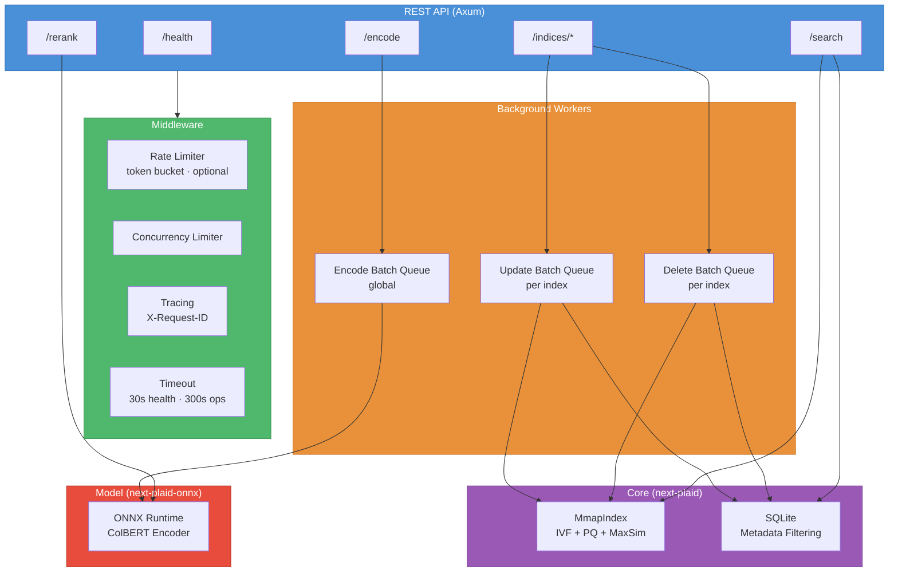
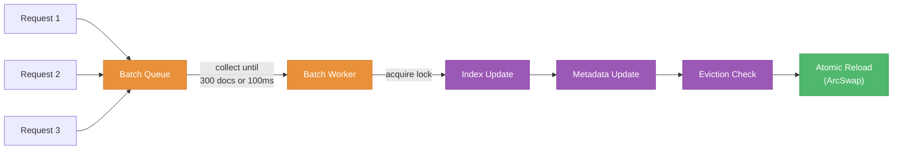

<div align="center">
  <h1>NextPlaid API</h1>
  <p>A REST API for multi-vector search with built-in text encoding.<br/>
  Async batching, metadata filtering, optional rate limiting, Swagger UI. Powers the <a href="../">NextPlaid</a> ecosystem.</p>

  <p>
    <a href="#quick-start"><b>Quick Start</b></a>
    &middot;
    <a href="#api-reference"><b>API Reference</b></a>
    &middot;
    <a href="#python-sdk"><b>Python SDK</b></a>
    &middot;
    <a href="#docker"><b>Docker</b></a>
    &middot;
    <a href="#architecture"><b>Architecture</b></a>
  </p>
</div>

---

## Quick Start

**Run with Docker (recommended):**

```bash
# CPU with built-in model
docker run -p 8080:8080 -v ~/.local/share/next-plaid:/data/indices \
  ghcr.io/lightonai/next-plaid:cpu-1.0.1 \
  --host 0.0.0.0 --port 8080 --index-dir /data/indices \
  --model lightonai/answerai-colbert-small-v1-onnx --int8

# GPU with CUDA
docker run --gpus all -p 8080:8080 -v ~/.local/share/next-plaid:/data/indices \
  ghcr.io/lightonai/next-plaid:cuda-1.0.1 \
  --host 0.0.0.0 --port 8080 --index-dir /data/indices \
  --model lightonai/GTE-ModernColBERT-v1 --cuda
```

**Use from Python:**

```bash
pip install next-plaid-client
```

```python
from next_plaid_client import NextPlaidClient, IndexConfig

client = NextPlaidClient("http://localhost:8080")

# Create index and add documents
client.create_index("docs", IndexConfig(nbits=4))
client.add("docs",
    documents=["NextPlaid is a multi-vector database", "ColGREP searches code semantically"],
    metadata=[{"id": "doc_1"}, {"id": "doc_2"}],
)

# Search
results = client.search("docs", ["vector database"])

# Search with metadata filtering
results = client.search("docs", ["coding tool"],
    filter_condition="id = ?", filter_parameters=["doc_1"],
)

# Delete by predicate
client.delete("docs", "id = ?", ["doc_1"])
```

**Or call the API directly:**

```bash
# Create index
curl -X POST http://localhost:8080/indices \
  -H 'Content-Type: application/json' \
  -d '{"name": "docs", "config": {"nbits": 4}}'

# Add documents (text encoded server-side)
curl -X POST http://localhost:8080/indices/docs/update_with_encoding \
  -H 'Content-Type: application/json' \
  -d '{"documents": ["hello world"], "metadata": [{"title": "test"}]}'

# Search
curl -X POST http://localhost:8080/indices/docs/search_with_encoding \
  -H 'Content-Type: application/json' \
  -d '{"queries": ["hello"], "params": {"top_k": 5}}'
```

Interactive docs at [http://localhost:8080/swagger-ui](http://localhost:8080/swagger-ui).

---

## Two Modes

NextPlaid API runs in two modes depending on whether you pass `--model`:

| | **With `--model`** | **Without `--model`** |
| --- | --- | --- |
| **Encoding** | Pass text, get results. Server encodes via ONNX Runtime. | You encode externally, pass embedding arrays. |
| **Endpoints** | All endpoints available, including `*_with_encoding` | Core endpoints only. Encoding endpoints return 400. |
| **Use case** | Production deployments, Python SDK | Custom models, external encoding pipelines |

---

## API Reference

### Health & Documentation

| Method | Path | Description |
| ------ | ---- | ----------- |
| `GET` | `/health` | Health check with system info, model config, all index summaries |
| `GET` | `/` | Alias for `/health` |
| `GET` | `/swagger-ui` | Interactive Swagger UI |
| `GET` | `/api-docs/openapi.json` | OpenAPI 3.0 specification |

### Index Management

| Method | Path | Description |
| ------ | ---- | ----------- |
| `GET` | `/indices` | List all indices |
| `POST` | `/indices` | Declare a new index (config only, no data) |
| `GET` | `/indices/{name}` | Get index info (docs, partitions, dimension) |
| `DELETE` | `/indices/{name}` | Delete an index and all its data |
| `PUT` | `/indices/{name}/config` | Update config (e.g. `max_documents`) |

### Documents

| Method | Path | Returns | Description |
| ------ | ---- | ------- | ----------- |
| `POST` | `/indices/{name}/update` | `202` | Add documents with pre-computed embeddings |
| `POST` | `/indices/{name}/update_with_encoding` | `202` | Add documents as text (server encodes) |
| `POST` | `/indices/{name}/documents` | `202` | Add to existing index (legacy) |
| `DELETE` | `/indices/{name}/documents` | `202` | Delete by SQL WHERE condition |

All document mutations return `202 Accepted` and process asynchronously. Concurrent requests to the same index are batched automatically.

### Search

| Method | Path | Description |
| ------ | ---- | ----------- |
| `POST` | `/indices/{name}/search` | Search with embedding arrays |
| `POST` | `/indices/{name}/search/filtered` | Search + SQL metadata filter |
| `POST` | `/indices/{name}/search_with_encoding` | Search with text queries |
| `POST` | `/indices/{name}/search/filtered_with_encoding` | Text search + metadata filter |

### Metadata

| Method | Path | Description |
| ------ | ---- | ----------- |
| `GET` | `/indices/{name}/metadata` | Get all metadata entries |
| `GET` | `/indices/{name}/metadata/count` | Count metadata entries |
| `POST` | `/indices/{name}/metadata/check` | Check which doc IDs have metadata |
| `POST` | `/indices/{name}/metadata/query` | Get doc IDs matching SQL condition |
| `POST` | `/indices/{name}/metadata/get` | Get metadata by IDs or SQL condition |
| `POST` | `/indices/{name}/metadata/update` | Update metadata rows matching condition |

### Encoding & Reranking

| Method | Path | Description |
| ------ | ---- | ----------- |
| `POST` | `/encode` | Encode texts to ColBERT embeddings |
| `POST` | `/rerank` | Rerank with pre-computed embeddings (MaxSim) |
| `POST` | `/rerank_with_encoding` | Rerank with text (server encodes + MaxSim) |

---

## Request & Response Examples

### Create Index

```bash
POST /indices
```
```json
{
  "name": "my_index",
  "config": {
    "nbits": 4,
    "batch_size": 50000,
    "seed": 42,
    "start_from_scratch": 999,
    "max_documents": 10000
  }
}
```

| Field | Default | Description |
| ----- | ------- | ----------- |
| `nbits` | `4` | Quantization bits (2 or 4) |
| `batch_size` | `50000` | Documents per indexing chunk |
| `seed` | `null` | Random seed for K-means |
| `start_from_scratch` | `999` | Below this doc count, full rebuild on update |
| `max_documents` | `null` | Evict oldest when exceeded (null = unlimited) |

### Add Documents (text)

```bash
POST /indices/my_index/update_with_encoding
```
```json
{
  "documents": ["Paris is the capital of France.", "Berlin is the capital of Germany."],
  "metadata": [{"country": "France"}, {"country": "Germany"}],
  "pool_factor": 2
}
```

Returns `202 Accepted`. The `pool_factor` reduces token count via hierarchical clustering (e.g. 2 = ~50% fewer embeddings per document).

### Add Documents (embeddings)

```bash
POST /indices/my_index/update
```
```json
{
  "documents": [
    {"embeddings": [[0.1, 0.2, 0.3], [0.4, 0.5, 0.6]]},
    {"embeddings": [[0.7, 0.8, 0.9], [0.1, 0.2, 0.3]]}
  ],
  "metadata": [{"title": "Doc A"}, {"title": "Doc B"}]
}
```

### Search (text)

```bash
POST /indices/my_index/search_with_encoding
```
```json
{
  "queries": ["What is the capital of France?"],
  "params": {"top_k": 10}
}
```

**Response:**

```json
{
  "results": [{
    "query_id": 0,
    "document_ids": [0, 1],
    "scores": [18.42, 12.67],
    "metadata": [{"country": "France"}, {"country": "Germany"}]
  }],
  "num_queries": 1
}
```

### Search with Filter

```bash
POST /indices/my_index/search/filtered_with_encoding
```
```json
{
  "queries": ["capital city"],
  "params": {"top_k": 5},
  "filter_condition": "country = ?",
  "filter_parameters": ["France"]
}
```

### Search Parameters

| Parameter | Default | Description |
| --------- | ------- | ----------- |
| `top_k` | `10` | Results to return per query |
| `n_ivf_probe` | `8` | IVF cells to probe per query token |
| `n_full_scores` | `4096` | Candidates for exact re-ranking |
| `centroid_score_threshold` | `null` | Prune low-scoring centroids (e.g. `0.4`) |

### Delete Documents

```bash
DELETE /indices/my_index/documents
```
```json
{
  "condition": "country = ? AND year < ?",
  "parameters": ["outdated", 2020]
}
```

Returns `202 Accepted`. Deletes are batched: multiple delete requests within a short window are processed together.

### Encode

```bash
POST /encode
```
```json
{
  "texts": ["Paris is the capital of France."],
  "input_type": "document",
  "pool_factor": 2
}
```

**Response:**

```json
{
  "embeddings": [[[0.1, 0.2, ...], [0.3, 0.4, ...]]],
  "num_texts": 1
}
```

`input_type` is `"query"` or `"document"`. Queries use MASK token expansion. Documents filter padding tokens.

### Rerank

```bash
POST /rerank_with_encoding
```
```json
{
  "query": "What is the capital of France?",
  "documents": ["Paris is the capital of France.", "Berlin is the capital of Germany."],
  "pool_factor": null
}
```

**Response:**

```json
{
  "results": [
    {"index": 0, "score": 15.23},
    {"index": 1, "score": 8.12}
  ],
  "num_documents": 2
}
```

### Health

```bash
GET /health
```

```json
{
  "status": "healthy",
  "version": "1.0.1",
  "loaded_indices": 1,
  "index_dir": "/data/indices",
  "memory_usage_bytes": 104857600,
  "indices": [{
    "name": "my_index",
    "num_documents": 1000,
    "num_embeddings": 50000,
    "num_partitions": 512,
    "dimension": 128,
    "nbits": 4,
    "avg_doclen": 50.0,
    "has_metadata": true
  }],
  "model": {
    "name": "GTE-ModernColBERT-v1",
    "path": "/models/GTE-ModernColBERT-v1",
    "quantized": false,
    "embedding_dim": 128,
    "batch_size": 128,
    "num_sessions": 1,
    "query_prefix": "[Q] ",
    "document_prefix": "[D] ",
    "query_length": 48,
    "document_length": 300,
    "do_query_expansion": true
  }
}
```

---

## Error Codes

All errors return JSON:

```json
{"code": "ERROR_CODE", "message": "Human-readable description", "details": null}
```

| Code | HTTP | When |
| ---- | ---- | ---- |
| `INDEX_NOT_FOUND` | 404 | Index does not exist |
| `INDEX_ALREADY_EXISTS` | 409 | Index name already taken |
| `INDEX_NOT_DECLARED` | 404 | Must `POST /indices` before updating |
| `BAD_REQUEST` | 400 | Invalid parameters |
| `DIMENSION_MISMATCH` | 400 | Embedding dim doesn't match index |
| `METADATA_NOT_FOUND` | 404 | No metadata database for this index |
| `MODEL_NOT_LOADED` | 400 | Encoding endpoint needs `--model` |
| `MODEL_ERROR` | 500 | ONNX inference failed |
| `SERVICE_UNAVAILABLE` | 503 | Queue full, retry later |
| `RATE_LIMITED` | 429 | Too many requests, requires `RATE_LIMIT_ENABLED` (retry after 2s) |
| `INTERNAL_ERROR` | 500 | Unexpected server error |

---

## Python SDK

```bash
pip install next-plaid-client
```

Both sync and async clients:

```python
from next_plaid_client import NextPlaidClient, AsyncNextPlaidClient
from next_plaid_client import IndexConfig, SearchParams

# Sync
client = NextPlaidClient("http://localhost:8080")

# Async
client = AsyncNextPlaidClient("http://localhost:8080")
await client.search("docs", ["query"])
```

### SDK Methods

| Method | Description |
| ------ | ----------- |
| `client.health()` | Health check |
| `client.create_index(name, config)` | Create index |
| `client.delete_index(name)` | Delete index |
| `client.get_index(name)` | Get index info |
| `client.list_indices()` | List all indices |
| `client.add(name, documents, metadata)` | Add documents (text or embeddings) |
| `client.search(name, queries, params, filter_condition, filter_parameters)` | Search |
| `client.delete(name, condition, parameters)` | Delete by filter |
| `client.encode(texts, input_type, pool_factor)` | Encode texts |
| `client.rerank(query, documents)` | Rerank documents |

---

## Docker

### Images

```bash
# CPU (amd64 + arm64)
docker pull ghcr.io/lightonai/next-plaid:cpu-1.0.1

# CUDA (amd64, requires NVIDIA GPU)
docker pull ghcr.io/lightonai/next-plaid:cuda-1.0.1
```

The Docker entrypoint auto-downloads HuggingFace models. Pass `org/model` as `--model` and it handles the rest. Set `HF_TOKEN` for private models.

### Docker Compose (CPU)

```yaml
services:
  next-plaid-api:
    image: ghcr.io/lightonai/next-plaid:cpu-1.0.1
    ports:
      - "8080:8080"
    volumes:
      - ${NEXT_PLAID_DATA:-~/.local/share/next-plaid}:/data/indices
      - ${NEXT_PLAID_MODELS:-~/.cache/huggingface/next-plaid}:/models
    environment:
      - RUST_LOG=info
    command:
      - --host
      - "0.0.0.0"
      - --port
      - "8080"
      - --index-dir
      - /data/indices
      - --model
      - lightonai/answerai-colbert-small-v1-onnx
      - --int8
      - --parallel
      - "16"
      - --batch-size
      - "4"
    healthcheck:
      test: ["CMD", "curl", "-f", "--max-time", "5", "http://localhost:8080/health"]
      interval: 15s
      timeout: 5s
      retries: 2
      start_period: 120s
    restart: unless-stopped
    deploy:
      resources:
        limits:
          memory: 16G
```

### Docker Compose (CUDA)

```yaml
services:
  next-plaid-api:
    image: ghcr.io/lightonai/next-plaid:cuda-1.0.1
    ports:
      - "8080:8080"
    volumes:
      - ${NEXT_PLAID_DATA:-~/.local/share/next-plaid}:/data/indices
      - ${NEXT_PLAID_MODELS:-~/.cache/huggingface/next-plaid}:/models
    environment:
      - RUST_LOG=info
      - NVIDIA_VISIBLE_DEVICES=all
    command:
      - --host
      - "0.0.0.0"
      - --port
      - "8080"
      - --index-dir
      - /data/indices
      - --model
      - lightonai/GTE-ModernColBERT-v1
      - --cuda
      - --batch-size
      - "128"
    healthcheck:
      test: ["CMD", "curl", "-f", "--max-time", "5", "http://localhost:8080/health"]
      interval: 15s
      timeout: 5s
      retries: 2
      start_period: 120s
    restart: unless-stopped
    deploy:
      resources:
        limits:
          memory: 16G
        reservations:
          devices:
            - driver: nvidia
              count: 1
              capabilities: [gpu]
```

### Volume Mounts

| Host Path | Container Path | Purpose |
| --------- | -------------- | ------- |
| `~/.local/share/next-plaid` | `/data/indices` | Persistent index storage |
| `~/.cache/huggingface/next-plaid` | `/models` | HuggingFace model cache |

---

## CLI Reference

```
next-plaid-api [OPTIONS]
```

| Flag | Default | Description |
| ---- | ------- | ----------- |
| `-h, --host` | `0.0.0.0` | Bind address |
| `-p, --port` | `8080` | Bind port |
| `-d, --index-dir` | `./indices` | Index storage directory |
| `-m, --model` | *(none)* | ONNX model path or HuggingFace ID |
| `--cuda` | off | CUDA for model inference |
| `--int8` | off | INT8 quantized model (~2x faster on CPU) |
| `--parallel` | `1` | Parallel ONNX sessions (recommended: 8-25 for throughput) |
| `--batch-size` | auto | Batch size per session (32 CPU, 64 GPU, 2 parallel) |
| `--threads` | auto | Threads per ONNX session (auto: 1 when parallel) |
| `--query-length` | `48` | Max query length in tokens |
| `--document-length` | `300` | Max document length in tokens |
| `--model-pool-size` | `1` | Number of model worker instances for concurrent encoding |

```bash
# Embeddings-only (no model)
next-plaid-api -p 3000 -d /data/indices

# CPU with model
next-plaid-api --model lightonai/answerai-colbert-small-v1-onnx --int8 --parallel 16

# GPU
next-plaid-api --model lightonai/GTE-ModernColBERT-v1 --cuda --batch-size 128

# Debug logging
RUST_LOG=debug next-plaid-api --model ./models/colbert
```

---

## Architecture



### Concurrency Design

The API uses **lock-free reads** and **batched writes** for high throughput:

- **Reads (search, metadata queries):** Lock-free via `ArcSwap`. Readers never block, even during writes.
- **Index updates:** Per-index batch queue collects requests, processes up to 300 documents (or 100ms timeout) in a single atomic operation.
- **Deletes:** Per-index delete queue batches conditions, resolves IDs inside the lock to handle ID shifting correctly.
- **Encoding:** Global worker pool with `N` model instances. Requests are grouped by `input_type` and `pool_factor`, then encoded in a single batch.
- **Auto-repair:** Before every update/delete, the API checks if the vector index and SQLite metadata are in sync. If not, it repairs automatically.



### Rate Limiting

Rate limiting is **optional and disabled by default**. Enable it by setting `RATE_LIMIT_ENABLED=true`. When enabled, the API applies a token bucket algorithm to a subset of routes:

| Scope | Rate limited? | Why exempt |
| ----- | ------------- | ---------- |
| `/health`, `/` | No | Monitoring must always work |
| `GET /indices`, `GET /indices/{name}` | No | Clients poll during async operations |
| `POST /indices/{name}/update*` | No | Has per-index semaphore protection |
| `DELETE /indices/{name}`, `DELETE /indices/{name}/documents` | No | Has internal batching |
| `/encode`, `/rerank*` | No | Has internal backpressure via queue |
| Everything else | Yes | Standard rate limiting |

---

## Environment Variables

### Rate Limiting & Concurrency

| Variable | Default | Description |
| -------- | ------- | ----------- |
| `RATE_LIMIT_ENABLED` | `false` | Enable rate limiting (`true`, `1`, or `yes` to enable) |
| `RATE_LIMIT_PER_SECOND` | `50` | Sustained requests/second (when enabled) |
| `RATE_LIMIT_BURST_SIZE` | `100` | Max burst size (when enabled) |
| `CONCURRENCY_LIMIT` | `100` | Max concurrent in-flight requests |

### Document Batching

| Variable | Default | Description |
| -------- | ------- | ----------- |
| `MAX_QUEUED_TASKS_PER_INDEX` | `10` | Max pending updates per index (503 when full) |
| `MAX_BATCH_DOCUMENTS` | `300` | Documents per batch before processing |
| `BATCH_CHANNEL_SIZE` | `100` | Buffer for document batch queue |

### Encode Batching

| Variable | Default | Description |
| -------- | ------- | ----------- |
| `MAX_BATCH_TEXTS` | `64` | Texts per encoding batch |
| `ENCODE_BATCH_CHANNEL_SIZE` | `256` | Buffer for encode batch queue |

### Delete Batching

| Variable | Default | Description |
| -------- | ------- | ----------- |
| `DELETE_BATCH_MIN_WAIT` | `500` | Min wait (ms) after first delete before processing |
| `DELETE_BATCH_MAX_WAIT` | `2000` | Max wait (ms) for accumulating deletes |
| `MAX_DELETE_BATCH_CONDITIONS` | `200` | Max conditions per delete batch |

### Logging

| Variable | Default | Description |
| -------- | ------- | ----------- |
| `RUST_LOG` | `info` | Log level (`debug`, `info`, `warn`, `error`) |
| `HF_TOKEN` | *(none)* | HuggingFace token for private model downloads |

---

## Feature Flags

| Feature | Description |
| ------- | ----------- |
| *(default)* | Core API, no BLAS, no model support |
| `openblas` | OpenBLAS for matrix operations (Linux) |
| `accelerate` | Apple Accelerate (macOS) |
| `model` | ONNX model encoding (`/encode`, `*_with_encoding`) |
| `cuda` | CUDA acceleration (implies `model`) |

```bash
# Embeddings-only API
cargo build --release -p next-plaid-api

# With model support (CPU, Linux)
cargo build --release -p next-plaid-api --features "openblas,model"

# With CUDA
cargo build --release -p next-plaid-api --features "cuda"
```

---

## Modules

| Module | Lines | Description |
| ------ | ----: | ----------- |
| `handlers/documents` | 1,638 | Index CRUD, update batching, delete batching, eviction, auto-repair |
| `models` | 759 | All request/response JSON schemas with OpenAPI annotations |
| `handlers/encode` | 549 | Encode worker pool, batch grouping by input type, ONNX inference |
| `state` | 488 | `AppState`, `IndexSlot` (ArcSwap), model pool, config caching |
| `handlers/search` | 449 | Search + filtered search, metadata enrichment, text-to-search pipeline |
| `handlers/metadata` | 484 | Metadata CRUD: check, query, get, count, update |
| `handlers/rerank` | 292 | ColBERT MaxSim scoring, text and embedding reranking |
| `error` | 138 | Error types with HTTP status code mapping |
| `tracing_middleware` | 115 | Request tracing via `X-Request-ID` header |
| `main` | 887 | CLI argument parsing, router construction, Swagger UI, server startup |
| `lib` | 44 | `PrettyJson` response type, module re-exports |

---

## Dependencies

| Crate | Purpose |
| ----- | ------- |
| `next-plaid` | Core PLAID index (IVF + PQ + MaxSim) |
| `next-plaid-onnx` | ColBERT ONNX encoding (optional) |
| `axum` 0.8 | Web framework |
| `tokio` | Async runtime |
| `tower` / `tower-http` | Middleware (CORS, tracing, timeout, concurrency) |
| `tower_governor` | Rate limiting (token bucket) |
| `utoipa` / `utoipa-swagger-ui` | OpenAPI generation + Swagger UI |
| `arc-swap` | Lock-free index swapping |
| `parking_lot` | Fast read-write locks |
| `sysinfo` | Process memory usage for `/health` |
| `uuid` | Request trace IDs |
| `ndarray` | N-dimensional arrays |
| `serde` / `serde_json` | Serialization |

---

## License

Apache-2.0
