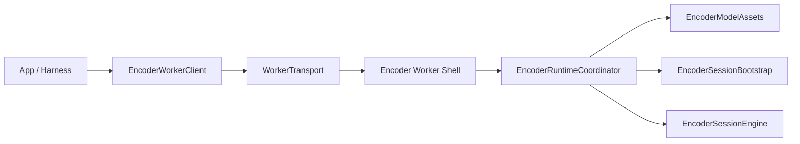
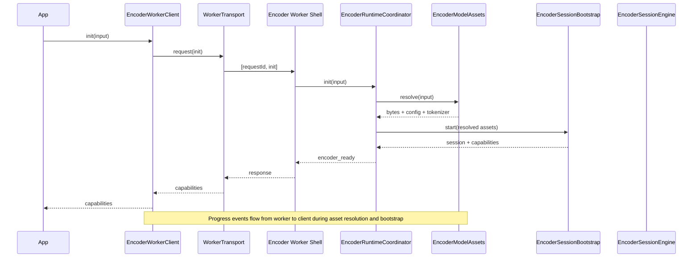
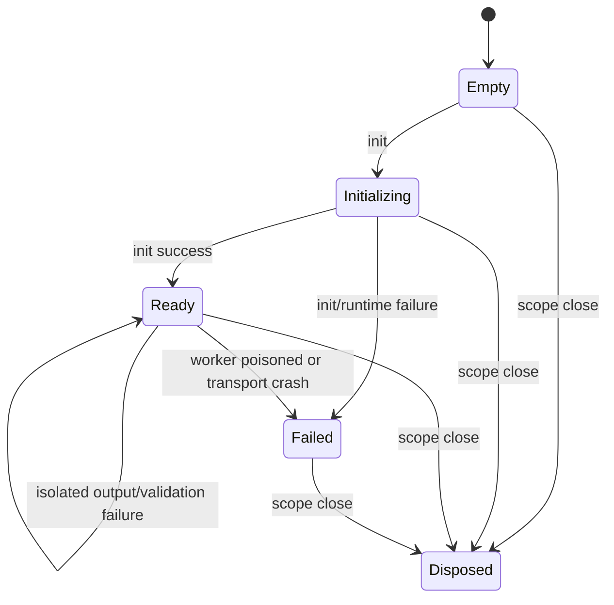

# Encoder Runtime Service Architecture

Written: 2026-04-20
Status: proposed W1.5 follow-up after the worker-runner cutover
Companion docs:
- `2026-04-20-browser-wrapper-implementation-plan.md`
- `HANDOFF_BROWSER_WRAPPER_W1.md`

## Purpose

This note narrows the next architecture slice for the encoder path.

It is based on:

- the live code after the shared worker-runner cutover
- the current browser-wrapper plan
- a multi-agent review of the encoder worker, wrapper/runtime seam, and
  next-slice sequencing

This is intentionally not a new top-level runtime plan. It is a focused
follow-up for the encoder side, where the code is still carrying too many
responsibilities in the same units.

## What is confirmed in live code

### 1. The worker shell is already thin enough

`browser-src/model-worker/encoder-worker.ts` is no longer a bespoke transport
entrypoint. The shared runner seam is already in place:

- request decode
- runner hookup
- handoff into the worker runtime

That means the next slice should build above this seam, not replace it.

### 2. Lifecycle ownership is still split across too many layers

The live encoder path has three different state owners:

- `worker-transport.ts`: pending requests, transport failure, scope-close
- `encoder-worker-client.ts`: public state, `initDeferred`, `readyGate`,
  event queue
- `encoder-worker.ts`: worker-local backend state, `health`, `dispose`,
  request serialization

That split is the main source of awkward nesting. There is no single lifecycle
owner for the encoder path today.

### 3. The backend still lumps together four different concerns

`browser-src/model-worker/wasm-encoder-backend.ts` currently mixes:

- asset resolution and Cache Storage policy
- JSON/config/tokenizer loading
- session bootstrap and warmup
- steady-state encode/health/dispose work

Those are different lifetimes and should not keep living in one module.

### 4. The event story is weaker than the state story

The wrapper client state can move to `failed` without emitting a terminal
`failed` lifecycle event, depending on how the failure enters the system.

That means the stream and the state ref do not currently describe the same
lifecycle truth.

### 5. `health` and `dispose` still exist as worker contract leftovers

That is acceptable internally, but they should be treated as worker-private
compatibility operations, not as the public wrapper architecture we are still
designing toward.

### 6. The backend reports more config than the encode path actually uses

The current backend reads ONNX config and exposes capability data from it, but
the live encode path still hardcodes several tokenization/runtime choices.

That means:

- "reported config"
- "effective encode plan"

are not yet the same thing.

W1.5 should close that gap by giving the encoder one explicit internal
configuration/encode-plan owner.

### 7. The public wrapper shape hides a hard serialization limit

The transport currently serializes all worker requests through a single permit.

That is acceptable as a current invariant, but the next slice should treat it
as explicit design, not accidental behavior:

- either document it as a one-request-at-a-time worker runtime
- or redesign it intentionally later

W1.5 should keep the invariant and make sure the rest of the lifecycle model is
built around it rather than quietly pretending the worker is more concurrent
than it is.

## Design goal for the next slice

The goal is not "invent a bigger runtime".

The goal is:

1. keep the worker shell thin
2. give the worker runtime one clear coordinator
3. split setup-time concerns from steady-state encode work
4. make terminal lifecycle ownership unambiguous
5. preserve the current wrapper-to-worker message shape unless there is a
   compelling reason to widen it

## Recommended service split

### Worker shell

File role:
- `browser-src/model-worker/encoder-worker.ts`

Responsibility:
- decode incoming worker requests
- connect the shared worker entrypoint to the encoder runtime
- contain no real business logic

Rule:
- this file should not own backend state, asset policy, or session bootstrap

### `EncoderRuntimeCoordinator`

Proposed role:
- worker-side service that becomes the single owner of the worker-local state
  machine

Responsibility:
- own `empty | initializing | ready | failed | disposed`
- own the current live session-backed encoder engine
- serialize request handling
- define what `init`, `encode`, `health`, and `dispose` mean
- translate worker-internal failures into worker contract responses

Why this exists:
- today this logic is spread through `encoder-worker.ts`
- it is the natural place to keep the worker-local truth

### `EncoderModelAssets`

Proposed role:
- worker-side service for setup-only asset work

Responsibility:
- fetch model bytes
- read/write Cache Storage
- load and parse `onnx_config.json`
- load tokenizer artifact
- validate asset identity and config shape

Important note:
- this service should be extracted now even if we do not yet move asset
  ownership up to the wrapper layer
- W1.5 is about getting the responsibilities separated cleanly first

### `EncoderSessionBootstrap`

Proposed role:
- worker-side service that turns resolved assets into a live encoder session

Responsibility:
- configure ORT
- create the inference session
- warm it up
- derive capabilities
- emit setup-progress events for these phases

Why this exists:
- startup and steady-state encode are different phases with different failure
  modes

### `EncoderSessionEngine`

Proposed role:
- steady-state session-backed encoder implementation

Responsibility:
- tokenize input
- build inference feeds
- run inference
- validate output type, rank, shape, and finiteness
- return encoded query plus timings
- answer simple `health`
- release the live session on `dispose`

Why this exists:
- this is the actual runtime core
- it should not know about Cache Storage or bootstrap policy
- it should consume one explicit effective encode plan, not a mix of parsed
  config plus hardcoded runtime choices

## Boundary ownership rules

### Public lifecycle owner

`EncoderWorkerClient` should remain the one public lifecycle state machine.

That means:

- app code reads `SubscriptionRef<EncoderStateSnapshot>`
- app code reads `Stream<EncoderLifecycleEvent>`
- app code does not infer worker truth from raw worker responses

### Worker-local lifecycle owner

`EncoderRuntimeCoordinator` should remain private to the worker.

That means:

- worker-local `state` is implementation detail
- wrapper state is the public truth
- the two may differ internally, but there should be one explicit bridge
  between them instead of duplicated lifecycle rules

### Transport owner

`WorkerTransport` should own only:

- request correlation
- timeout
- pending-request cleanup
- transport crash/dispose signaling

It should not become a second lifecycle service for encoder semantics.

## Event model

The cleanest split is:

- worker emits setup and progress events
- wrapper emits terminal lifecycle events

### Worker-emitted events

These belong to the worker because they describe work happening inside the
worker runtime:

- `asset_fetch_start`
- `asset_cache_hit`
- `asset_cache_miss`
- `asset_fetch_complete`
- `config_validated`
- `session_create_start`
- `session_create_complete`
- `warmup_start`
- `warmup_complete`
- `ready`

Notes:

- the current `fetch_start` / `fetch_complete` shape is a start, but it is not
  enough once cache policy becomes its own service
- config validation should become visible because it is part of init truth,
  not just internal bookkeeping
- encode should remain a simple request/response path for now; if we ever want
  encode-time worker events, that should be an intentional protocol expansion,
  not an accidental hard failure at the transport boundary

### Wrapper-emitted terminal events

These should stay client-side:

- `{ stage: "failed"; error }`
- `{ stage: "disposed" }`

Reason:

- the wrapper owns the public lifecycle surface
- terminal lifecycle should not be emitted from two different owners

## State machine recommendation

### Public client state

Keep the public client state machine as:

- `empty`
- `initializing`
- `ready`
- `failed`
- `disposed`

But tighten the transition rules:

- `ready -> ready` for isolated output validation failures or one-off encode
  failures that do not poison the worker
- `ready -> failed` only for failures that actually invalidate the live worker
  lifetime
- `failed` and `disposed` are terminal for that client scope

### Worker-local state

The worker may internally support disposing and rebuilding its live engine, but
that should not become a same-scope public reset story in the wrapper yet.

For now, model reload still means:

- fresh wrapper scope
- fresh worker lifetime

## Confirmed seam problems to address in W1.5

### 1. Terminal lifecycle fan-out is inconsistent

When the worker crashes while the client is already ready and idle, the client
state can flip to `failed` without publishing a corresponding terminal event.

W1.5 should introduce one terminal-transition helper that always does the same
things:

- set public state
- fail `readyGate` / `initDeferred` if present
- publish exactly one terminal event

### 2. Late calls after dispose/failure are not enforced at one layer

`encode()` does its own disposed guard, `init()` has separate logic, and the
transport only partially models termination.

W1.5 should give the transport an explicit terminal status so:

- requests after `failed` or `disposed` fail immediately
- `init()` and `encode()` do not each carry partial lifetime policy

### 3. `messageerror` is in the model but not in the live platform seam

The current browser worker layer listens to `message` and `error`, but not
`messageerror`.

That means the lifecycle and error model should either:

- wire real `messageerror` handling at the platform edge, or
- stop treating it as a live failure path until it exists

### 4. Outbound request shape is trusted more than inbound shape

Replies and events are decoded carefully, but outbound worker requests are
still trusted structurally.

That is survivable today because the worker contract is small, but W1.5 should
either:

- validate outbound request construction at the wrapper boundary, or
- narrow the request-building surface so drift is harder to introduce

## Recommended slice split

## W1.5: encoder-boundary cleanup

This should be the next slice before the larger W2 policy work.

Scope:

1. Extract `EncoderModelAssets` from the current backend lump.
2. Extract `EncoderSessionBootstrap`.
3. Slim the live session-backed backend into `EncoderSessionEngine`.
4. Make `EncoderRuntimeCoordinator` the one worker-local lifecycle owner.
5. Add one wrapper-side terminal transition helper.
6. Tighten transport terminal status and late-call behavior.
7. Expand init events to distinguish asset/cache/validation phases.
8. Update diagrams and tests to match the new split.
9. Make one internal "effective encode plan" the source of truth for both
   capability reporting and real encode behavior.
10. Decide whether outbound worker requests get runtime validation now or stay
    compile-time only for this slice.

Non-goals:

- no app-facing runtime composition yet
- no cross-index compatibility cache yet
- no query-result cache yet
- no R4 lifetime redesign yet

## W2: policy and composition

After W1.5 is green:

1. Add `EncoderCacheService` for completed-query reuse and in-flight dedupe.
2. Add `BrowserSearchRuntime` composition.
3. Add explicit compatibility checks at composition time.
4. Decide whether any encoder cache or worker lifetime should outlive one
   wrapper scope.

## Plan corrections

The main browser-wrapper plan is directionally right, but several assumptions
are now stale after the worker-runner cutover:

- W1 is no longer "next"; the worker transport and both small clients already
  exist.
- the transport seam is no longer bespoke browser worker plumbing; both
  workers already run through the shared worker entrypoint layer
- the strongest remaining encoder problem is not transport shape, it is
  responsibility split inside the encoder runtime path

This note should therefore be read as an insertion between existing W1 and W2:

- W1 landed
- W1.5 cleans the encoder boundary and lifecycle ownership
- W2 adds policy and composition

## Diagrams to use going forward

### Service diagram

### Init dataflow

### Public state transitions

## Verification implications

Before W1.5 is considered complete, the tests should prove:

1. worker crash while ready emits both failed state and failed terminal event
2. scope close fails pending init and encode work exactly once
3. late `init()` and `encode()` after `failed` or `disposed` fail immediately
4. init event ordering includes asset/cache/validation phases before session
   creation
5. isolated encode validation failure does not necessarily poison a healthy
   worker lifetime

## Bottom line

Do not redesign the transport again.

Do not widen the wrapper-to-worker message contract unless a real need appears.

Do make the encoder side legible by separating:

- shell
- lifecycle coordinator
- asset service
- session bootstrap
- steady-state engine

That is the cleanest path from the current code to the larger runtime/service
architecture the wrapper plan already wants.
