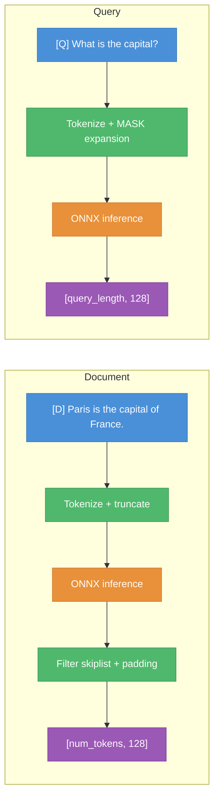

<div align="center">
  <h1>NextPlaid-ONNX</h1>
  <p>ColBERT multi-vector encoding with ONNX Runtime.<br/>
  A Python CLI for exporting HuggingFace models to ONNX, and a Rust crate for fast inference.</p>

  <p>
    <a href="#rust-crate"><b>Rust Crate</b></a>
    &middot;
    <a href="#python-export"><b>Python Export</b></a>
    &middot;
    <a href="#models"><b>Models</b></a>
  </p>
</div>

---

## Rust Crate

High-performance ColBERT inference with ONNX Runtime. Supports CPU, CUDA, TensorRT, CoreML, and DirectML.

### Quick Start

Add to `Cargo.toml`:

```toml
[dependencies]
next-plaid-onnx = "0.2"
```

Encode documents and queries:

```rust
use next_plaid_onnx::Colbert;

let model = Colbert::new("models/GTE-ModernColBERT-v1")?;

// Documents → Vec<Array2<f32>> with shape [num_tokens, embedding_dim]
let doc_embeddings = model.encode_documents(
    &["Paris is the capital of France."],
    None,  // No pooling
)?;

// Queries → Vec<Array2<f32>> with shape [query_length, embedding_dim]
let query_embeddings = model.encode_queries(
    &["What is the capital of France?"],
)?;
```

### Builder Pattern

```rust
use next_plaid_onnx::{Colbert, ExecutionProvider};

let model = Colbert::builder("models/GTE-ModernColBERT-v1")
    .with_quantized(true)                              // Use model_int8.onnx (~2x speedup)
    .with_parallel(25)                                 // 25 ONNX sessions
    .with_batch_size(2)                                // Documents per inference call
    .with_execution_provider(ExecutionProvider::Cuda)   // Force specific backend
    .with_query_length(32)                             // Override config max query tokens
    .with_document_length(512)                         // Override config max document tokens
    .build()?;
```

### Hardware Acceleration

```toml
# NVIDIA CUDA
next-plaid-onnx = { version = "0.2", features = ["cuda"] }

# NVIDIA TensorRT (optimized CUDA)
next-plaid-onnx = { version = "0.2", features = ["tensorrt"] }

# Apple Silicon / CoreML
next-plaid-onnx = { version = "0.2", features = ["coreml"] }

# Windows DirectML (DirectX 12)
next-plaid-onnx = { version = "0.2", features = ["directml"] }
```

`ExecutionProvider::Auto` tries providers in order: CUDA → TensorRT → CoreML → DirectML → CPU. Set `NEXT_PLAID_FORCE_CPU=1` to bypass all GPU providers.

### Token Pooling

Reduce token count with hierarchical clustering (Ward's method):

```rust
// Keep ~50% of tokens
let pooled = model.encode_documents(&docs, Some(2))?;

// Keep ~33% of tokens
let pooled = model.encode_documents(&docs, Some(3))?;
```

The CLS token is always preserved. Clusters are replaced by their centroid embedding.

### Performance Tuning

| Mode | Config | Best for |
| ---- | ------ | -------- |
| Single-session CPU | `.with_threads(8).with_batch_size(32)` | Simple workloads |
| Parallel CPU | `.with_quantized(true).with_parallel(25).with_batch_size(2)` | High throughput |
| GPU | `.with_execution_provider(ExecutionProvider::Cuda).with_batch_size(64)` | Large batches |

### API Reference

#### `Colbert`

```rust
impl Colbert {
    pub fn new<P: AsRef<Path>>(model_dir: P) -> Result<Self>;
    pub fn builder<P: AsRef<Path>>(model_dir: P) -> ColbertBuilder;

    pub fn encode_documents(
        &self, documents: &[&str], pool_factor: Option<usize>,
    ) -> Result<Vec<Array2<f32>>>;

    pub fn encode_queries(&self, queries: &[&str]) -> Result<Vec<Array2<f32>>>;

    pub fn config(&self) -> &ColbertConfig;
    pub fn embedding_dim(&self) -> usize;
    pub fn batch_size(&self) -> usize;
    pub fn num_sessions(&self) -> usize;
}
```

#### `ColbertBuilder`

```rust
impl ColbertBuilder {
    pub fn with_parallel(self, num_sessions: usize) -> Self;
    pub fn with_threads(self, num_threads: usize) -> Self;
    pub fn with_batch_size(self, batch_size: usize) -> Self;
    pub fn with_execution_provider(self, provider: ExecutionProvider) -> Self;
    pub fn with_quantized(self, quantized: bool) -> Self;
    pub fn with_query_length(self, query_length: usize) -> Self;
    pub fn with_document_length(self, document_length: usize) -> Self;
    pub fn build(self) -> Result<Colbert>;
}
```

#### `ExecutionProvider`

```rust
pub enum ExecutionProvider {
    Auto,      // Best available (default)
    Cpu,       // CPU only
    Cuda,      // NVIDIA CUDA (requires `cuda` feature)
    TensorRT,  // NVIDIA TensorRT (requires `tensorrt` feature)
    CoreML,    // Apple Silicon (requires `coreml` feature)
    DirectML,  // Windows DirectX 12 (requires `directml` feature)
}
```

#### `ColbertConfig`

Loaded automatically from `onnx_config.json` in the model directory.

```rust
pub struct ColbertConfig {
    pub query_prefix: String,           // "[Q] "
    pub document_prefix: String,        // "[D] "
    pub query_length: usize,            // 32
    pub document_length: usize,         // 180
    pub do_query_expansion: bool,       // true
    pub embedding_dim: usize,           // 128
    pub uses_token_type_ids: bool,      // false for ModernBERT
    pub mask_token_id: u32,
    pub pad_token_id: u32,
    pub skiplist_words: Vec<String>,    // Punctuation to filter from docs
    pub do_lower_case: bool,
}
```

### Hierarchical Clustering Module

Scipy-compatible hierarchical clustering, used internally for token pooling:

```rust
use next_plaid_onnx::hierarchy::{pdist_cosine, linkage, fcluster, LinkageMethod, FclusterCriterion};

let distances = pdist_cosine(&embeddings_flat, n_samples, n_features);
let linkage_matrix = linkage(&distances, n_samples, LinkageMethod::Ward);
let labels = fcluster(&linkage_matrix, n_samples, FclusterCriterion::MaxClust, k as f64);
```

Supported methods: `Ward`, `Single`, `Complete`, `Average`, `Weighted`.

---

## How Encoding Works



**Documents:** Text is prefixed with `[D]`, tokenized, run through the ONNX model, then skiplist tokens (punctuation) and padding are removed. Output shape varies per document.

**Queries:** Text is prefixed with `[Q]`, tokenized, then padded with `[MASK]` tokens to `query_length`. MASK tokens enable query augmentation &mdash; the model learns useful expansions during training. Output shape is fixed.

---

## Python Export

A CLI tool for exporting HuggingFace ColBERT models to ONNX format. Creates both FP32 and INT8 quantized versions by default.

### Install

```bash
pip install pylate-onnx-export
```

Requires Python 3.10-3.12.

### Export a model

```bash
# Export (creates model.onnx + model_int8.onnx)
pylate-onnx-export lightonai/GTE-ModernColBERT-v1

# Export to specific directory
pylate-onnx-export lightonai/GTE-ModernColBERT-v1 -o ./my-models

# Export + push to HuggingFace Hub
pylate-onnx-export lightonai/GTE-ModernColBERT-v1 -o ./my-models --push-to-hub myorg/my-onnx-model

# FP32 only
pylate-onnx-export lightonai/GTE-ModernColBERT-v1 --no-quantize

# Quantize existing model
colbert-quantize ./models/GTE-ModernColBERT-v1
```

### Python API

```python
from colbert_export import export_model, quantize_model, push_to_hub

# Export
output_dir = export_model("lightonai/GTE-ModernColBERT-v1", quantize=True)

# Quantize existing
quantized_path = quantize_model("./models/GTE-ModernColBERT-v1")

# Push to Hub
push_to_hub("./models/GTE-ModernColBERT-v1", "myorg/my-onnx-model")
```

### Output structure

```
models/<model-name>/
├── model.onnx           # FP32 ONNX model
├── model_int8.onnx      # INT8 quantized (~4x smaller, ~2x faster)
├── tokenizer.json       # HuggingFace fast tokenizer
└── onnx_config.json     # Model config for inference
```

### Export pipeline

```
HuggingFace model
       ↓
PyLate ColBERT (adds [Q]/[D] tokens, extends embeddings)
       ↓
ColBERTForONNX (transformer + linear projection + L2 norm)
       ↓
torch.onnx.export (opset 14, dynamic batch/sequence axes)
       ↓
INT8 dynamic quantization (default)
```

### CLI reference

```
pylate-onnx-export [OPTIONS] MODEL_NAME

Arguments:
  MODEL_NAME              HuggingFace model name or local path

Options:
  -o, --output-dir DIR    Output directory (default: ./models/<model-name>)
  --no-quantize           Skip INT8 quantization
  -f, --force             Force re-export even if exists
  --push-to-hub REPO_ID   Push to HuggingFace Hub
  --private               Make Hub repository private
  --quiet                 Suppress progress messages
```

---

## Models

Any [PyLate-compatible ColBERT model](https://huggingface.co/models?other=PyLate) works when exported to ONNX. These are ready to use:

| Model | Use case |
| ----- | -------- |
| `lightonai/LateOn-Code-edge` | Code search, lightweight |
| `lightonai/LateOn-Code` | Code search, accurate |
| `lightonai/answerai-colbert-small-v1-onnx` | Text retrieval, lightweight |
| `lightonai/GTE-ModernColBERT-v1` | Text retrieval, accurate |

---

## License

Apache-2.0
