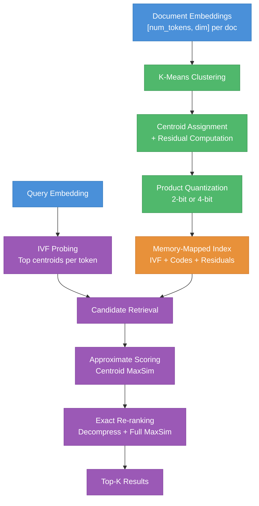

<div align="center">
  <h1>NextPlaid</h1>
  <p>A Rust library for multi-vector search using the PLAID algorithm.<br/>
  Memory-mapped, quantized, incremental. Powers <a href="../colgrep">ColGREP</a> and the <a href="../next-plaid-api">NextPlaid API</a>.</p>

  <p>
    <a href="#quick-start"><b>Quick Start</b></a>
    &middot;
    <a href="#architecture"><b>Architecture</b></a>
    &middot;
    <a href="#api-reference"><b>API Reference</b></a>
    &middot;
    <a href="#filtering"><b>Filtering</b></a>
    &middot;
    <a href="#cuda-acceleration"><b>CUDA</b></a>
  </p>
</div>

---

## Quick Start

Add to `Cargo.toml`:

```toml
[dependencies]
next-plaid = "1.0"
```

Create an index, add documents, search:

```rust
use next_plaid::{MmapIndex, IndexConfig, UpdateConfig, SearchParameters};
use ndarray::Array2;

// Each document is a 2D array [num_tokens, embedding_dim]
let embeddings: Vec<Array2<f32>> = encode_documents(&docs);

// Create index (or update if it already exists)
let index_config = IndexConfig { nbits: 4, ..Default::default() };
let update_config = UpdateConfig::default();
let (index, doc_ids) = MmapIndex::update_or_create(
    &embeddings, "/path/to/index", &index_config, &update_config,
)?;

// Search
let query: Array2<f32> = encode_query("search text");
let params = SearchParameters { top_k: 10, ..Default::default() };
let results = index.search(&query, &params, None)?;

for (id, score) in results.passage_ids.iter().zip(results.scores.iter()) {
    println!("Doc {}: {:.4}", id, score);
}
```

---

## Why Multi-Vector?

Standard vector search collapses a document into **one** embedding. That's lossy. Multi-vector search (ColBERT) keeps **one embedding per token** (~300 vectors per document, dim 128). At query time, each query token finds its best match across all document tokens (**MaxSim**). This preserves fine-grained information that single-vector models lose.

The trade-off is storage. NextPlaid solves this with product quantization (2-bit or 4-bit) and memory-mapped indices, making million-document collections practical on a single machine.

---

## Architecture



### Indexing Pipeline

1. **K-Means clustering** on all token embeddings to find centroids (IVF codebook)
2. **Assign** each token to its nearest centroid, compute **residual** (difference)
3. **Quantize** residuals with product quantization (2-bit: 4 buckets, 4-bit: 16 buckets)
4. **Write** IVF posting lists, codes, and residuals as memory-mapped NPY files
5. Optionally store document **metadata** in a co-located SQLite database

### Search Pipeline

1. **IVF probing** &mdash; Score query tokens against centroids, select top `n_ivf_probe` centroids per token
2. **Candidate retrieval** &mdash; Collect document IDs from selected posting lists
3. **Approximate scoring** &mdash; MaxSim using centroid vectors (fast, coarse)
4. **Re-ranking** &mdash; Decompress top `n_full_scores` candidates, compute exact ColBERT MaxSim
5. **Return** top `top_k` results with scores

MaxSim scoring is SIMD-accelerated (AVX2 on x86_64, NEON on ARM) and optionally BLAS-accelerated via Apple Accelerate or OpenBLAS.

### Update Modes

Incremental updates use three strategies depending on index size:

| Mode | Condition | Behavior |
| ---- | --------- | -------- |
| **Rebuild** | `num_docs <= start_from_scratch` (default: 999) | Load existing embeddings + new, full K-means rebuild |
| **Buffer** | `new_docs < buffer_size` (default: 100) | Assign to existing centroids, buffer for later |
| **Expand** | `new_docs >= buffer_size` | Find outlier embeddings, expand centroids via K-means, re-index buffer + new |

---

## Installation

### Feature Flags

| Feature | Platform | Description |
| ------- | -------- | ----------- |
| *(default)* | All | Pure Rust, no external BLAS |
| `accelerate` | macOS | Apple Accelerate for BLAS (recommended on M-series) |
| `openblas` | Linux | OpenBLAS for BLAS |
| `cuda` | Linux/Windows | CUDA acceleration for K-means and MaxSim scoring |

```toml
# macOS (recommended)
[dependencies]
next-plaid = { version = "1.0", features = ["accelerate"] }

# Linux with OpenBLAS
[dependencies]
next-plaid = { version = "1.0", features = ["openblas"] }

# Linux with CUDA + OpenBLAS
[dependencies]
next-plaid = { version = "1.0", features = ["cuda", "openblas"] }
```

<details>
<summary><b>OpenBLAS system setup</b></summary>

```bash
# Debian/Ubuntu
sudo apt install libopenblas-dev

# Fedora/RHEL
sudo dnf install openblas-devel

# Arch
sudo pacman -S openblas
```

</details>

---

## API Reference

### `MmapIndex`

The primary interface. Loads index files as memory-mapped arrays for low RAM usage.

```rust
// Load existing index
let index = MmapIndex::load("/path/to/index")?;

// Create or update (creates if missing, appends if exists)
let (index, doc_ids) = MmapIndex::update_or_create(
    &embeddings, "/path/to/index", &index_config, &update_config,
)?;

// Search (single query)
let results = index.search(&query, &params, None)?;

// Search (batch)
let results = index.search_batch(&queries, &params, true, None)?;

// Search within a subset of documents
let results = index.search(&query, &params, Some(&subset_ids))?;

// Add documents to existing index
let new_ids = index.update(&new_embeddings, &update_config)?;

// Add documents with metadata
let new_ids = index.update_with_metadata(
    &new_embeddings, &update_config, Some(&metadata),
)?;

// Delete documents
let deleted = index.delete(&[5, 10, 15])?;

// Reconstruct embeddings from compressed storage
let embeddings = index.reconstruct(&[0, 1, 2])?;
let single = index.reconstruct_single(0)?;

// Accessors
index.num_documents();
index.num_embeddings();
index.num_partitions();
index.avg_doclen();
index.embedding_dim();
```

### `IndexConfig`

Controls index creation.

```rust
IndexConfig {
    nbits: 4,                    // Quantization bits (2 or 4)
    batch_size: 50_000,          // Documents per indexing chunk
    seed: Some(42),              // Random seed for K-means
    kmeans_niters: 4,            // K-means iterations
    max_points_per_centroid: 256,// K-means parameter
    n_samples_kmeans: None,      // Auto: min(1 + 16*sqrt(120*N), N)
    start_from_scratch: 999,     // Rebuild threshold
    force_cpu: false,            // Force CPU K-means (skip CUDA)
}
```

### `SearchParameters`

Controls search behavior.

```rust
SearchParameters {
    top_k: 10,                       // Results to return
    n_full_scores: 4096,             // Candidates for exact re-ranking
    n_ivf_probe: 8,                  // IVF cells to probe per query token
    centroid_batch_size: 100_000,    // Batch size for centroid scoring
    centroid_score_threshold: Some(0.4), // Prune low-scoring centroids
    batch_size: 2000,                // Query batch size
}
```

### `UpdateConfig`

Controls incremental updates.

```rust
UpdateConfig {
    batch_size: 50_000,          // Documents per chunk
    kmeans_niters: 4,            // K-means iterations for centroid expansion
    max_points_per_centroid: 256,
    n_samples_kmeans: None,
    seed: 42,
    start_from_scratch: 999,     // Below this, rebuild from scratch
    buffer_size: 100,            // Buffer before centroid expansion
    force_cpu: false,
}
```

### `QueryResult`

Search results container.

```rust
pub struct QueryResult {
    pub query_id: usize,
    pub passage_ids: Vec<i64>,  // Document IDs (ranked by score)
    pub scores: Vec<f32>,       // Corresponding scores
}
pub type SearchResult = QueryResult;
```

### `Metadata`

Index metadata, persisted as `metadata.json`.

```rust
pub struct Metadata {
    pub num_chunks: usize,
    pub nbits: usize,
    pub num_partitions: usize,
    pub num_embeddings: usize,
    pub avg_doclen: f64,
    pub num_documents: usize,
    pub embedding_dim: usize,
    pub next_plaid_compatible: bool,
}
```

### `ResidualCodec`

Quantization codec for compression and decompression.

```rust
// Load codec from index directory
let codec = ResidualCodec::load_from_dir(&index_path)?;
let codec = ResidualCodec::load_mmap_from_dir(&index_path)?; // memory-mapped centroids

// Compress embeddings to codes (nearest centroid assignments)
let codes = codec.compress_into_codes(&embeddings);

// Quantize residuals
let quantized = codec.quantize_residuals(&residuals)?;

// Decompress back to approximate embeddings
let reconstructed = codec.decompress(&packed, &codes)?;

// Accessors
codec.embedding_dim();
codec.num_centroids();
codec.centroids_view();
```

---

## Filtering

SQLite-based metadata filtering via the `filtering` module. Store arbitrary JSON metadata alongside your index, query with SQL WHERE clauses.

```rust
use next_plaid::filtering;
use serde_json::json;

// Create metadata database alongside index
let metadata = vec![
    json!({"title": "Doc A", "category": "tech", "score": 95}),
    json!({"title": "Doc B", "category": "science", "score": 87}),
];
filtering::create("/path/to/index", &metadata, &[0, 1])?;

// Append more metadata
filtering::update("/path/to/index", &new_metadata, &new_doc_ids)?;

// Query by SQL condition (parameterized, injection-safe)
let ids = filtering::where_condition(
    "/path/to/index",
    "category = ? AND score > ?",
    &[json!("tech"), json!(90)],
)?;

// Query with REGEXP support
let ids = filtering::where_condition_regexp(
    "/path/to/index",
    "title REGEXP ?",
    &[json!("^Doc")],
)?;

// Get full metadata rows
let rows = filtering::get("/path/to/index", None, &[], Some(&[0, 1]))?;

// Count documents
let count = filtering::count("/path/to/index")?;

// Delete and re-index
filtering::delete("/path/to/index", &[5, 10])?;

// Use in search: filter first, then search within subset
let subset = filtering::where_condition("/path/to/index", "category = ?", &[json!("tech")])?;
let results = index.search(&query, &params, Some(&subset))?;
```

SQL conditions are validated with a recursive descent parser that whitelists safe operators and prevents injection.

---

## CUDA Acceleration

When built with the `cuda` feature, NextPlaid automatically uses GPU acceleration for:

- **K-means clustering** during index creation and centroid expansion
- **MaxSim scoring** during search (for large enough matrices)

No code changes needed. CUDA falls back gracefully to CPU on failure.

```toml
[dependencies]
next-plaid = { version = "1.0", features = ["cuda"] }
```

The CUDA module uses cuBLAS for matrix multiplication and custom PTX kernels for argmax operations. A global `CudaContext` is lazily initialized on first use.

> **Tip:** First CUDA context creation can take 10-30s. Enable GPU persistence mode to reduce this: `sudo nvidia-smi -pm 1`

---

## Index File Structure

```
index_directory/
  metadata.json            # Index metadata (num_docs, nbits, partitions, etc.)
  centroids.npy            # Centroid embeddings [K, dim]
  avg_residual.npy         # Average residual per dimension
  bucket_cutoffs.npy       # Quantization boundaries
  bucket_weights.npy       # Reconstruction values
  cluster_threshold.npy    # Outlier detection threshold
  ivf.npy                  # Inverted file (doc IDs per centroid)
  ivf_lengths.npy          # Length of each IVF posting list
  plan.json                # Indexing plan
  merged_codes.npy         # Memory-mapped centroid codes (auto-merged)
  merged_residuals.npy     # Memory-mapped quantized residuals (auto-merged)
  metadata.db              # SQLite metadata database (optional)

  # Per-chunk files (merged into merged_*.npy on load):
  0.codes.npy              # Centroid assignments for chunk 0
  0.residuals.npy          # Quantized residuals for chunk 0
  0.metadata.json          # Chunk metadata
  doclens.0.json           # Document lengths for chunk 0
```

---

## Modules

| Module | Lines | Description |
| ------ | ----: | ----------- |
| `filtering` | 1,896 | SQLite metadata storage, SQL condition validation, REGEXP support |
| `mmap` | 1,779 | Memory-mapped NPY/raw arrays, merge-on-load, file locking |
| `index` | 1,389 | Index creation, `MmapIndex`, `IndexConfig`, `Metadata` |
| `update` | 977 | Incremental updates, buffer/expand strategies |
| `cuda` | 769 | CUDA context, cuBLAS MatMul, PTX argmax kernel |
| `codec` | 701 | Residual quantization, compress/decompress, lookup tables |
| `search` | 714 | IVF probing, candidate retrieval, approximate + exact scoring |
| `delete` | 540 | Document deletion, IVF rebuild |
| `kmeans` | 475 | K-means clustering, centroid computation, partition estimation |
| `maxsim` | 443 | SIMD MaxSim (AVX2/NEON), BLAS matrix multiply |
| `utils` | 237 | Quantile computation, array utilities |
| `embeddings` | 137 | Embedding reconstruction from compressed storage |
| `error` | 66 | Error types |

---

## Dependencies

| Crate | Purpose |
| ----- | ------- |
| `ndarray` | N-dimensional arrays |
| `rayon` | Parallelism |
| `memmap2` | Memory-mapped files |
| `ndarray-npy` | NPY file I/O |
| `fastkmeans-rs` | K-means clustering |
| `rusqlite` | SQLite (bundled) |
| `half` | Float16 support |
| `regex` | REGEXP filtering |
| `cudarc` | CUDA bindings (optional) |
| `serde` / `serde_json` | Serialization |
| `thiserror` | Error handling |

---

## License

Apache-2.0
