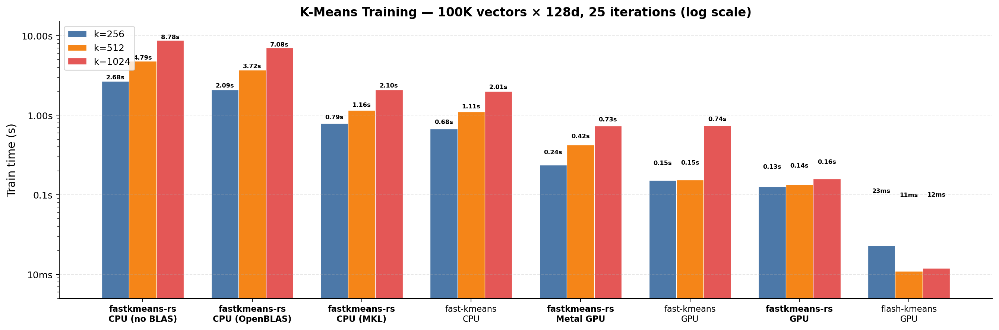

<h1 align="center">fastkmeans-rs</h1>

<p align="center">
  <a href="https://crates.io/crates/fastkmeans-rs"></a>
  <a href="https://github.com/lightonai/fastkmeans-rs/blob/master/LICENSE"></a>
</p>

<p align="center">
  <strong>A fast Rust implementation of k-means, based on <a href="https://github.com/AnswerDotAI/fastkmeans">fast-kmeans</a> and <a href="https://github.com/svg-project/flash-kmeans">flash-kmeans</a>.</strong>
</p>

<br>

## Installation

```toml
[dependencies]
fastkmeans-rs = "0.1"
```

### Features

| Feature | Platform | Description |
|---|---|---|
| `cuda` | NVIDIA GPU | Flash-accelerated CUDA with cuBLAS GEMM and warp-cooperative kernels |
| `metal_gpu` | macOS (Apple Silicon) | Metal Performance Shaders GPU acceleration |
| `accelerate` | macOS | Apple Accelerate BLAS for CPU |
| `mkl` | Linux (Intel/AMD) | Intel MKL for CPU (recommended for Linux, fastest) |
| `openblas` | Linux / Windows | OpenBLAS for CPU (requires `libopenblas-dev`) |

```toml
# NVIDIA GPU (recommended for Linux)
fastkmeans-rs = { version = "0.1", features = ["cuda"] }

# Apple Silicon GPU
fastkmeans-rs = { version = "0.1", features = ["metal_gpu", "accelerate"] }

# CPU-only with BLAS
fastkmeans-rs = { version = "0.1", features = ["mkl"] }          # Linux (fastest)
fastkmeans-rs = { version = "0.1", features = ["accelerate"] }   # macOS
fastkmeans-rs = { version = "0.1", features = ["openblas"] }     # Linux (fallback)
```

When `cuda` or `metal_gpu` is enabled, `FastKMeans` automatically uses the GPU. No code changes needed.

<br>

## Usage

```rust
use fastkmeans_rs::{FastKMeans, KMeansConfig};
use ndarray::Array2;
use ndarray_rand::RandomExt;
use ndarray_rand::rand_distr::Uniform;

// Generate data: 100K points, 128 dimensions
let data = Array2::random((100_000, 128), Uniform::new(-1.0f32, 1.0));

// Create model with 256 clusters
let config = KMeansConfig::new(256)
    .with_max_iters(25)
    .with_max_points_per_centroid(None);

let mut kmeans = FastKMeans::with_config(config);

// Train
kmeans.train(&data.view()).unwrap();

// Predict
let labels = kmeans.predict(&data.view()).unwrap();

// Or fit + predict in one call
let labels = kmeans.fit_predict(&data.view()).unwrap();

// Access centroids
let centroids = kmeans.centroids().unwrap(); // shape: (256, 128)
```

<br>

## Benchmarks

All benchmarks run with 25 iterations.

### fastkmeans-rs vs fast-kmeans vs flash-kmeans

Train **100K vectors, 128 dimensions**, 25 iterations.



> Compared against [fast-kmeans](https://github.com/AnswerDotAI/fastkmeans) and [flash-kmeans](https://github.com/svg-project/flash-kmeans) (optimized Triton kernels). CUDA/GPU benchmarks on H100, Metal GPU on Apple Silicon. fastkmeans-rs is pure Rust with no Python dependency.

<br>

## Acknowledgements

Based on [fast-kmeans](https://github.com/AnswerDotAI/fastkmeans) and [flash-kmeans](https://github.com/svg-project/flash-kmeans). Credit for the algorithm design goes to the original authors.

## License

Apache-2.0 — see [LICENSE](LICENSE).
